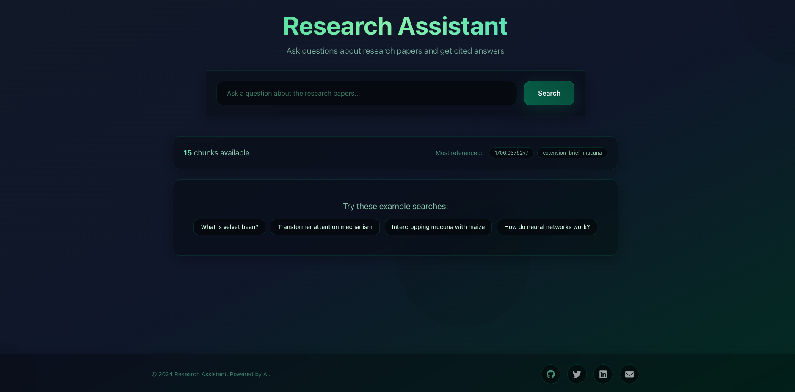

# Research Assistant



Semantic search for academic papers with FastAPI + React + ChromaDB.

## Setup

```sh
# Install just: https://github.com/casey/just

# Setup project
just setup
just install
```

## Run

```sh
just backend    # Start API server (localhost:8000)
just frontend   # Start web app (localhost:3000) 
just data      # Load sample data from data/sample_chunks.json
```

## Sample Data

Real academic paper chunks in `data/sample_chunks.json`:
- **ILRI Extension Brief**: Velvet bean cultivation (10 chunks)
- **Transformer Paper**: "Attention Is All You Need" (5 chunks)

## Try These Queries

- "What is velvet bean?"
- "Transformer attention mechanism"
- "Intercropping mucuna with maize"

## Configuration

Edit `backend/.env` for your settings:
```sh
PORT=8000
OPENAI_API_KEY=your-key-here  # Optional
```

## Docker

```sh
just docker  # Start full stack with docker-compose
```
